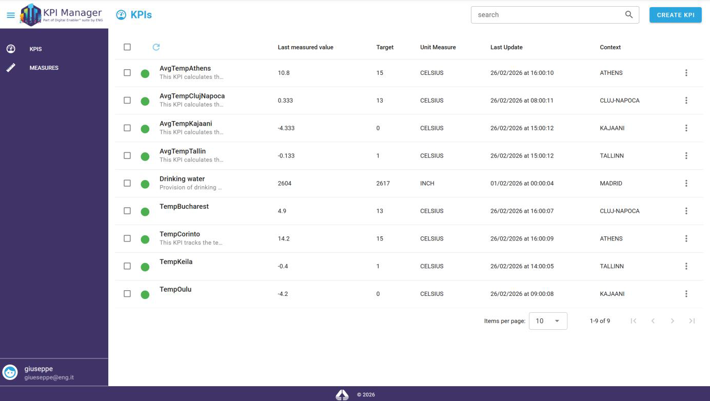
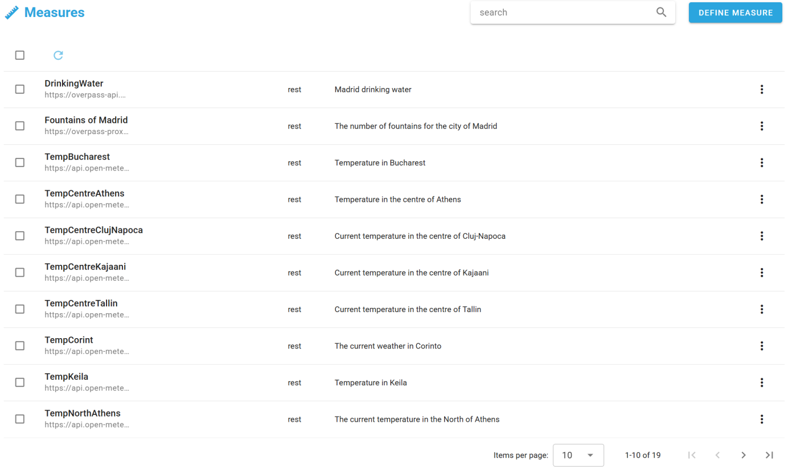
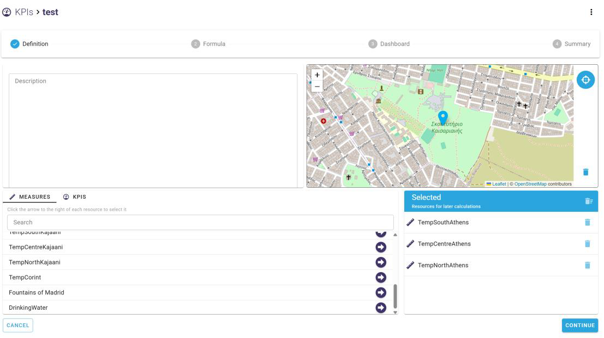
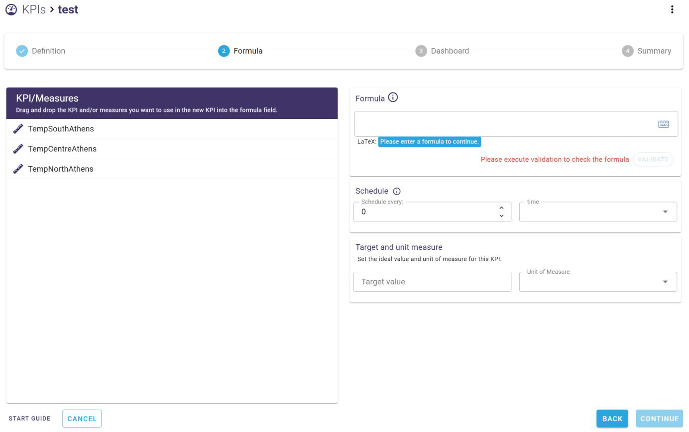
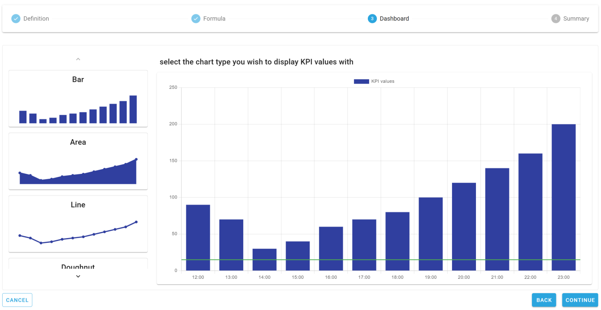
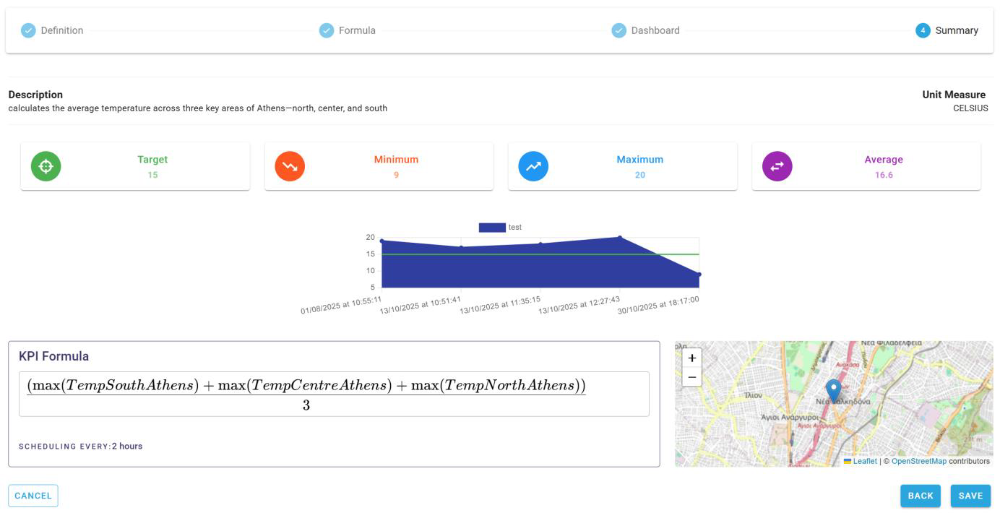

# KPI Manager

## Summary

- [Description](#description)
- [Features](#features)
- [Images](#images)
- [Installation Prerequisites](#installation-prerequisites)
- [External Technical Resources](#external-technical-resources)
- [User Guide](#user-guide)
- [Dependencies and Contacts](#dependencies-and-contacts)

---

## Description

The **KPI Manager** is a web-based application for defining, calculating, monitoring, and visualising Key Performance Indicators (KPIs).

It provides a centralised environment for collecting and processing KPI-related data from different sources and presenting the resulting indicators through interactive dashboards and visualisations.

The application allows users to configure KPIs according to specific business or project requirements, define their calculation logic, associate them with relevant measures, and monitor their evolution over time.

The KPI Manager is designed to support data-driven decision-making by providing users with a clear and structured view of performance indicators.

---

## Features

The main functionalities provided by the KPI Manager include:

- **KPI Creation and Management**  
  Create, configure, edit, duplicate, and delete KPIs.

- **KPI Definition**  
  Define KPI descriptions, target values, units of measurement, and contextual information.

- **Measure and KPI Association**  
  Associate KPIs with existing measures or other KPIs used as inputs for calculations.

- **Formula Definition**  
  Build KPI calculation formulas using available measures and statistical operations such as sum, average, minimum, maximum, median, mode, and standard deviation.

- **KPI Scheduling**  
  Configure the frequency at which KPI values are calculated and updated.

- **Dashboard Visualisation**  
  Visualise KPI data using different chart types, including bar, area, line, and doughnut charts.

- **Geographic Information**  
  Optionally associate a KPI with a geographic location and visualise it on a map.

- **KPI Monitoring**  
  Monitor KPI values, target values, minimum, maximum, and average values, as well as the current KPI status.

- **KPI Status Management**  
  Enable or stop KPI processing according to the user's requirements.

- **Search and Filtering**  
  Search for KPIs by name or description and navigate through the KPI list.

- **Export and Duplication**  
  Export KPI data and create copies of existing KPIs.

- **Multilingual Interface**  
  The user interface supports English and Italian languages.

---

## Images

---

## Installation Prerequisites

The KPI Manager requires a Kubernetes environment and access to the required container images.

The deployment relies on the following infrastructure components:

- **Kubernetes**
- **PostgreSQL**
- **Apache Kafka**
- **Telegraf**
- **InfluxDB**

---

## External Technical Resources

The KPI Manager relies on the following technologies and platforms:

- [Kubernetes](https://kubernetes.io/)
- [PostgreSQL](https://www.postgresql.org/)
- [Apache Kafka](https://kafka.apache.org/)
- [Telegraf](https://www.influxdata.com/time-series-platform/telegraf/)
- [InfluxDB](https://www.influxdata.com/)

---

## User Guide

The complete **KPI Manager User Guide** is available as a PDF and provides detailed instructions for configuring and using the application.

**[KPI Manager – User Guide](./kpi-manager-user-guide.pdf)**

The guide covers the complete KPI management workflow, including KPI creation, definition, formula configuration, scheduling, dashboard configuration, monitoring, and management of existing KPIs.

---

## Dependencies and Contacts

| | |
|---|---|
| **Dependencies** | Kubernetes, PostgreSQL, Apache Kafka, Telegraf, InfluxDB |
| **Contact** | rita.gaeta@eng.it |
| **License** | Proprietary |

---

## URBREATH Project

The KPI Manager is part of the **URBREATH project**, co-funded by the European Union under Grant Agreement No. **101139711**.

> The URBREATH project is co-funded by the European Union under grant agreement ID 101139711. The information and views set out in this document are those of the URBREATH Consortium and do not necessarily reflect those of the European Union. Neither the European Union nor the granting authority can be held responsible for them.
